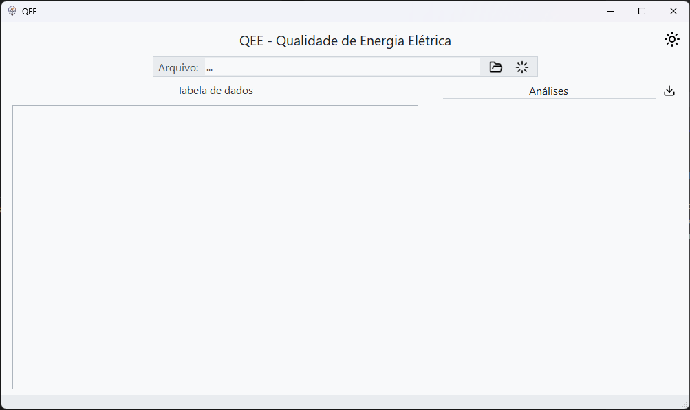

# QEE - Qualidade de Energia Elétrica

<p align="center">
  
</p>

Rotina em Python com interface gráfica para caracterização da Qualidade de Energia Elétrica de uma unidade consumidora.

## Recursos:
- Rotina em Python para caracterização da Qualidade de Energia Elétrica.
- Interface gráfica para facilitar a interação e utilização da rotina.
- Classes modulares para cálculo dos indicadores.
- Geração automatizada de relatórios com base nos índices do PRODIST.
- Testes com dados reais obtidos por um analisador de rede.
- Capacidade de gerar gráficos para facilitar a análise dos dados.

## Benefícios:
Os benefícios da rotina em Python com interface gráfica para caracterização da Qualidade de Energia Elétrica incluem:

1. **Automatização do Processo:** Reduz a necessidade de intervenção manual, tornando a análise mais eficiente e menos suscetível a erros humanos.

2. **Facilidade de Uso:** A interface gráfica torna a interação com a rotina mais intuitiva e acessível, permitindo que usuários com diferentes níveis de experiência possam utilizá-la.

3. **Análise Abrangente:** Possibilita a análise de diversos parâmetros da Qualidade de Energia Elétrica, como variação de tensão, distorção harmônica, fator de potência, entre outros, fornecendo uma visão completa da situação.

4. **Conformidade com Padrões:** Permite a verificação dos dados coletados em relação aos limites e indicadores estabelecidos pelo PRODIST, garantindo a conformidade com as normas regulatórias.

5. **Geração de Relatórios:** Facilita a elaboração de relatórios detalhados com base nos índices analisados, fornecendo informações claras e organizadas sobre a Qualidade de Energia Elétrica da unidade consumidora.

6. **Auxílio à Tomada de Decisão:** Fornece dados e análises que podem auxiliar na identificação de problemas, na implementação de melhorias e na tomada de decisões para otimizar o fornecimento de energia.

7. **Potencial de Pesquisa:** Serve como uma ferramenta de apoio para pesquisas futuras na área de Qualidade de Energia Elétrica, contribuindo para o avanço do conhecimento e desenvolvimento de novas soluções.

Esses benefícios combinados demonstram o valor e a importância da rotina desenvolvida para a análise e caracterização da Qualidade de Energia Elétrica, trazendo melhorias significativas para o setor elétrico e para os consumidores.

## Como instalar

Para utilizar o projeto, é recomendado instalar o gerenciador de dependências [Poetry](https://python-poetry.org/), que facilitará a instalação das bibliotecas necessárias. Siga os passos abaixo para instalar o Poetry e as dependências do projeto:

### Instalação do Poetry:

Acesse o a documentação [aqui](https://python-poetry.org/)

### Clonagem do repositório:

Clone o repositório do projeto para o seu ambiente local:

```bash
git clone https://github.com/tiaonazario/qee.git
```
### Ativação do ambiente virtual (opcional)

Para ativar o ambiente virtual criado pelo Poetry, navegue até o diretório do projeto e execute o comando:

```bash
poetry shell
```

### Instalação das dependências:

Navegue até o diretório do projeto e instale as dependências utilizando o Poetry:

```bash
poetry install
```

### Executar

Depois que todas as dependências forem instaladas execute o projeto

```bash
python .\main.py
```
Se tudo for realizado corretamente, a interface será iniciada conforme ilustrado na imagem a seguir:


## Como usar

Para utilizar a rotina desenvolvida para caracterização da Qualidade de Energia Elétrica, siga os passos abaixo:

1. Abra a interface gráfica do software.
2. Selecione o arquivo contendo os dados coletados pelo analisador de qualidade de energia.
3. Verifique se os dados foram corretamente importados e aparecem na tabela de dados.
4. Utilize o menu suspenso na tabela de dados para selecionar a função desejada, como gerar gráfico, analisar variação de tensão, fator de potência, distorções harmônicas, desequilíbrio de tensão, flutuações de tensão e variação de frequência.
5. Explore as funcionalidades disponíveis para analisar os diferentes aspectos da Qualidade de Energia Elétrica da unidade consumidora.
6. Ao final da análise, gere o relatório com base nos índices e limites estabelecidos no PRODIST.

Certifique-se de seguir as orientações da interface gráfica e das mensagens informativas para uma utilização correta e eficiente da rotina em Python desenvolvida para a caracterização da Qualidade de Energia Elétrica.

## Principais bibliotecas utilizadas

1. **Pandas:** Utilizada para análise dos dados coletados pelo analisador de Qualidade de Energia Elétrica, permitindo trabalhar com DataFrames e Series de forma eficiente.

2. **NumPy:** Empregada para verificação das informações contidas nos arquivos, cálculo de percentis e tamanho das bases de dados.

3. **Matplotlib:** Utilizada para a geração de gráficos das tensões analisadas, possibilitando visualizações claras e informativas dos dados.

4. **PySide6:** Responsável pela criação da interface gráfica do software, permitindo a visualização e interação com os dados de forma amigável e personalizável.

Essas bibliotecas desempenham papéis fundamentais no desenvolvimento e funcionamento da rotina, contribuindo para a análise, visualização e interação com os dados relacionados à Qualidade de Energia Elétrica da unidade consumidora.
